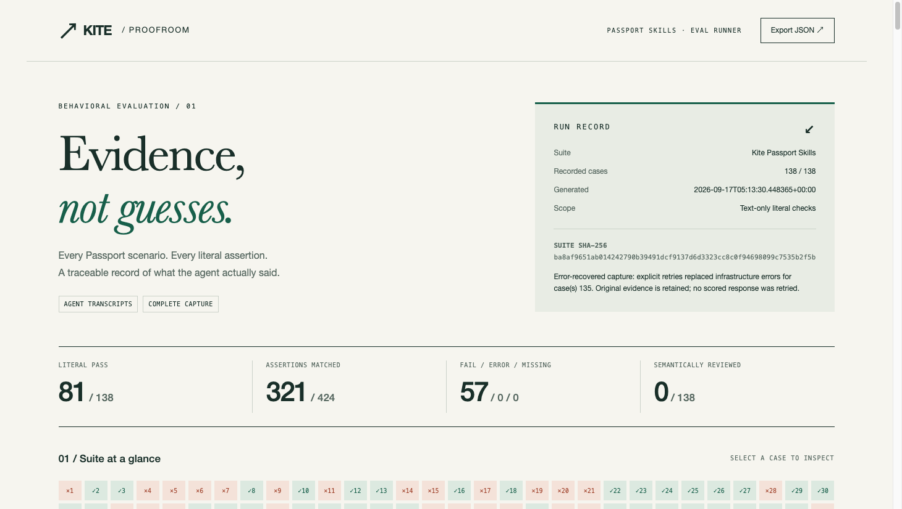

# Kite Proofroom

**An auditable evaluation runner for Kite Passport Skills. Evidence, not guesses.**

[Browse the report](https://veithly.github.io/kite-passport-eval/) · [CI](https://github.com/veithly/kite-passport-eval/actions/workflows/ci.yml) · [中文说明](README.zh-CN.md) · [Acceptance evidence](docs/ACCEPTANCE.md)

Proofroom fills the automated-runner gap described in the official [Passport evaluation README](https://github.com/gokite-ai/passport-skills/blob/1ff773981566ac1755ccf23e98983cd76c81bf08/evals/README.md). It executes the unchanged 138-case suite through a replaceable agent adapter, checks every one of its 424 literal assertions, and exports an offline evidence ledger plus JSON, Markdown, JUnit and SHA-256 manifests.

This is independent, AI-assisted community work by **Rick / @veithly**, not an official Kite product. Original upstream cases and documentation remain credited to Kite AI under [their MIT license](LICENSE.upstream). The runner, report interface, tests and integration are new work under [MIT](LICENSE).



[Desktop and mobile QA evidence](docs/UI_QA.md)

## What is actually verified

| Layer | Recorded result | Meaning |
|---|---:|---|
| Runner tests | 32 passed, zero skipped | Input validation, resource limits, escaping, review gates, recovery and compatibility |
| Assertion deletion tests | 424/424 detected | Removing any official required literal makes its case fail |
| Full real model capture | 138/138 valid responses | Text-only Claude Haiku 4.5 responses; not mock answers |
| Literal case score | 81 pass / 57 fail | 321 of 424 exact strings matched; failures remain visible |
| Infrastructure recovery | One explicit retry, case 135 | Original 80-pass/57-fail/1-error first pass is retained |
| Semantic reviews | 0/138 for the live run | No claim that literal passes prove correct or safe behavior |
| On-chain actions | None | No account login, wallet send, payment or seller deployment was executed |

**Green CI means the runner and frozen replay are correct, not that every model response passed.** Replay must reproduce the real failures too. Fresh model output is nondeterministic; the preserved transcripts, not a future model response, are the reproducible benchmark.

## Quick start: no model account required

Python 3.9+ and Git are sufficient. Run these commands from this repository's root. The source-mode runner has **zero third-party runtime dependencies**.

```bash
git clone https://github.com/veithly/kite-passport-eval.git
cd kite-passport-eval
git clone https://github.com/gokite-ai/passport-skills.git vendor/passport-skills
git -C vendor/passport-skills checkout 1ff773981566ac1755ccf23e98983cd76c81bf08

python3 -m kite_eval validate --suite vendor/passport-skills/evals/evals.json --pinned
python3 scripts/verify.py --upstream vendor/passport-skills --out runs/verify-01 --require-live
```

The second command generates a complete verification bundle: unit log, synthetic positive harness check, four documented regression fixtures and the replay of all 138 real captures. Use a **new output directory** for every run; overwrites are deliberately refused.

To inspect only the real capture:

```bash
python3 -m kite_eval replay \
  --suite vendor/passport-skills/evals/evals.json --pinned \
  --transcripts evidence/recovered/transcripts.jsonl \
  --out runs/replay-01
# Exit 1 is expected: the preserved agent responses have 57 literal failures.
python3 -m http.server 8765 --bind 127.0.0.1 --directory runs/replay-01
```

Open `http://127.0.0.1:8765`. The generated `index.html` also works directly offline. Search prompts, assertions and responses; filter by skill or status; click a matrix cell to open its full evidence. Download all report formats without a backend.

Optional package installation: `python3 -m pip install .` adds the `kite-eval` command. Package building uses setuptools; the installed runner still has no third-party runtime dependencies.

## Fresh live evaluation — explicit opt-in

This path requires **macOS or Linux**, an authenticated Claude Code CLI supporting the flags in `adapters/claude_safe.py`, and model allowance. The recorded release used CLI **2.1.202**, Python **3.9.6**, and the model reported by the CLI as **claude-haiku-4-5**.

```bash
python3 -m kite_eval run \
  --upstream vendor/passport-skills \
  --adapter adapters/claude-safe.json \
  --jobs 2 --timeout 120 --out runs/fresh-01
```

The adapter disables tools, custom skills, hooks, MCP, browser integration and session persistence. It asks for proposed commands and conditional outcomes, never real execution. Each request contains the original prompt and official skill/reference documents; **`expected_output` and `assertions` are not passed to the adapter**. The upstream tracked checkout must be clean and pinned.

The CLI receives a $0.10 per-call budget setting. This is not an independent guarantee about provider billing or transport retries. The runner itself never retries. The 138 successful release captures report **$1.477029** in model usage metadata; this is not an account invoice, and excludes the separate pilot and any unreported usage from the failed call.

`--ids 9` runs a pilot but still reports the entire suite denominator: 137 missing cases are not silently waived. Partial captures return nonzero. A JSONL journal preserves completed calls if interrupted; replay it to see missing cases rather than blindly repeating paid work.

## Adapters and assertion semantics

An adapter config is exactly `{"name":"my-agent","argv":["python3","my_adapter.py"]}`. The argv list is executed without a shell. One request arrives as JSON on stdin; return a single JSON object with `response` (string) and optional `metadata` (object) on stdout. Diagnostics belong on stderr, which is bounded and retained as a hash, not published as raw text. See [the protocol and reproducibility guide](docs/REPRODUCIBILITY.md).

Assertions are **case-sensitive literal substring checks**, not regex, fuzzy matching, command execution or an LLM judge. Each check includes a zero-based Unicode character offset and one-based line number. Missing captures and adapter errors fail all their assertions and are never marked skipped.

Preserve the official four-field array format for additional suites: `id`, `prompt`, `expected_output`, `assertions`. `validate` and `replay` accept custom suites without `--pinned`; `run` intentionally targets this pinned official suite and its explicit skill mapping. The [four regression cases](evidence/verification/known-failures-suite.json) demonstrate unchanged format.

A literal match can still hide an unsafe instruction. Optional `--reviews reviews.json` attaches a verdict, reviewer, rationale and exact evidence quote bound to the response SHA-256. `--require-review` makes pending reviews fail both the process and JUnit. Reviews never change the literal result. See the case-31 blind spot in [failure analysis](docs/FAILURE_ANALYSIS.md).

| Exit code | Meaning |
|---|---|
| `0` | Every requested gate passed |
| `1` | Literal failure, missing/error response, failed review or required pending review |
| `2` | Malformed input, drift, invalid configuration or filesystem/infrastructure problem |
| `130` | Interrupted; preserve the journal |

## Evidence layout

`evidence/live/` is the unmodified first pass. `evidence/retry-135/` is the single isolated retry. `evidence/recovered/` combines only that error recovery and includes its source hashes. `evidence/verification/` contains the full local release verification. `evidence/capture-inventory.json` lists every failed literal, actual model metadata and a conservative secret-pattern scan. [Recovery code](scripts/recover.py) refuses to replace an already scored response or change the request/adapter hash.

The responsive offline HTML escapes all dynamic text, renders no model-generated HTML, uses no CDN, and works without JavaScript for reading cases. JavaScript only enhances filters and navigation. See [security boundaries](SECURITY.md) before running third-party adapters or publishing your own captures.

## CI and contributions

[CI](.github/workflows/ci.yml) verifies on Linux/Python 3.9 and 3.13, and macOS/Python 3.13. It downloads the pinned upstream source but executes no upstream setup script and makes no live model calls. GitHub Actions are pinned to verified commit SHAs, credentials are not persisted, and PR jobs have read-only repository permissions. A separate main-branch Pages deployment publishes only the reviewed report after checks succeed.

Contributions should include a failing test and its fix, preserve corpus integrity and provenance, and never substitute synthetic fixtures for live evidence. For newly added upstream cases, update the pinned revision, hash and explicit skill mapping together, then generate a fresh versioned capture. Do not alter old evidence in place.
